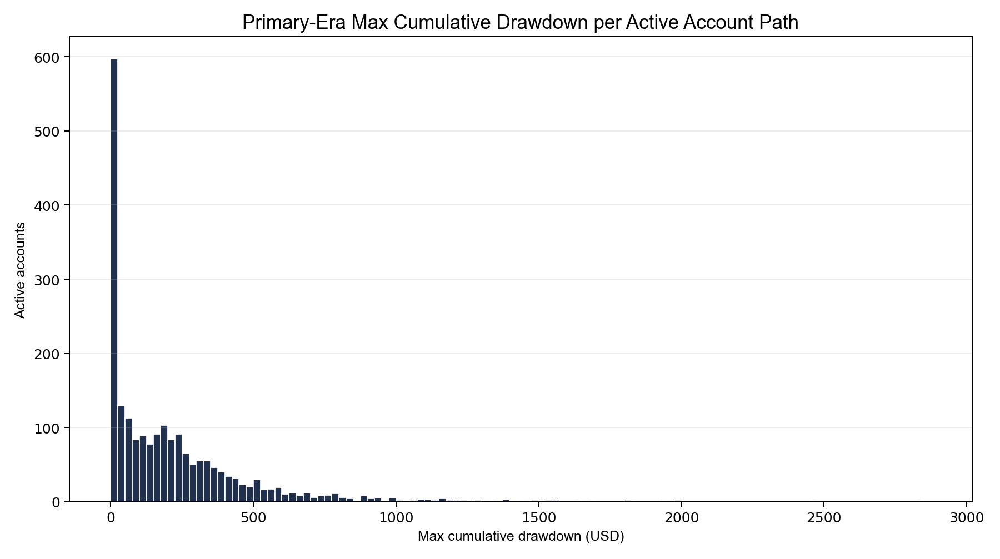
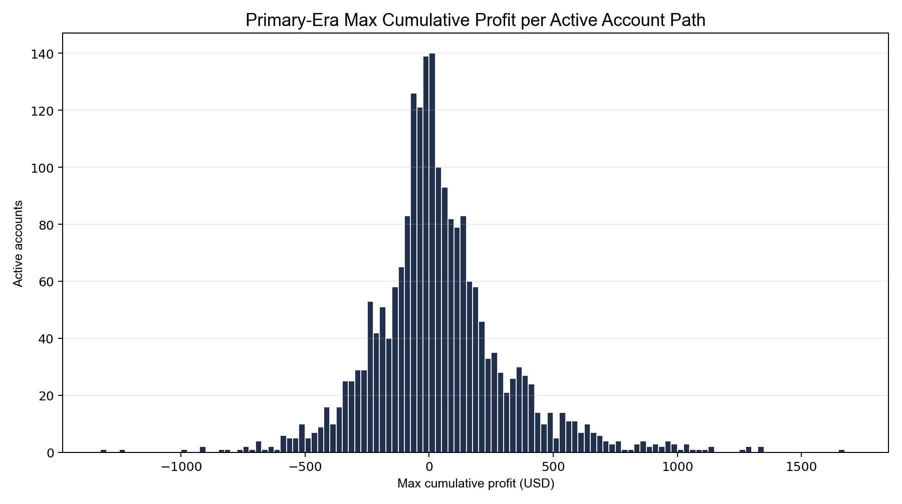

**SUPERSEDED — see [balance_verification.md](../balance_verification.md). Retained for audit trail. Conclusions in this file are not current. Reason: this inference was superseded by C22's confirmation of the $5,000 starting balance.**

# Balance Inference

This report uses only realized USD path quantities and makes no assumed starting-balance normalization.

Method:

- Build one path per active `(campaignId, accountId)` in campaigns `C53-C65`.
- Compute cumulative net P&L in USD across each path.
- Record each path's `max_profit_usd = max(cum_pnl_usd)` and `max_drawdown_usd = max(running_peak_cum_pnl - cum_pnl_usd)`.
- Test for a cliff using rounded `$25` bins and the strongest local mode; a candidate must have count >= `25` and prominence ratio >= `1.50` versus its local neighborhood.

No common cliff is visible in the primary-era USD paths under the local-mode rule. That means the 4% drawdown / 8% target rule is not visibly binding at a single shared dollar threshold in this data.

## Summary Stats

| metric | value | method |
| --- | --- | --- |
| primary_positions | 6582.0000 | count of position rows in campaigns C53-C65 with test campaigns excluded |
| active_account_campaigns | 2117.0000 | count of active `(campaignId, accountId)` paths in the primary era |
| unique_account_ids | 496.0000 | distinct `accountId` values in the primary era |
| max_drawdown_usd_median | 137.9900 | median of per-account-path max cumulative drawdown in USD |
| max_drawdown_usd_p90 | 520.7560 | 90th percentile of per-account-path max cumulative drawdown in USD |
| max_profit_usd_median | 9.2000 | median of per-account-path max cumulative profit in USD |
| max_profit_usd_p90 | 372.2760 | 90th percentile of per-account-path max cumulative profit in USD |

## Strongest Local Modes

| distribution | rounded_bin_usd | count | neighbor_median_count | prominence_ratio | passes_cliff_rule |
| --- | --- | --- | --- | --- | --- |
| max_drawdown_usd | 50.0000 | 132.0000 | 109.5000 | 1.2055 | False |
| max_profit_usd | 125.0000 | 87.0000 | 75.5000 | 1.1523 | False |

## Charts

